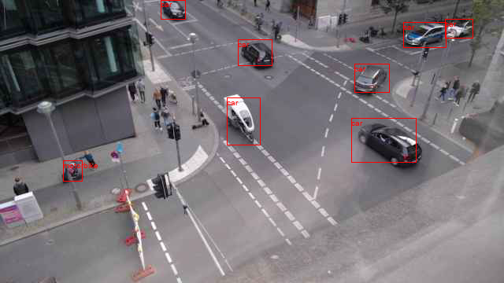
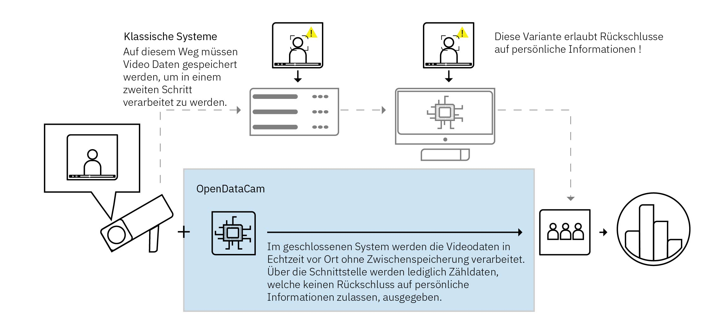

# Open Traffic Count

Urbane Mobilität ist ein wichtiger Faktor im Zusammenspiel verschiedener Akteure im städtischen Raum und hat entscheidenden Einfluss auf das Wohlbefinden der Bürgerinnen und Bürger in Städten. Für bedarfsgerechte Verbesserung von Verkehrsbedingungen in Städten, um langfristige Staus, Unfälle und Verschmutzungen zu verringern, bedarf es umfassender und transparenter Datengrundlagen. Neuere Entwicklungen im Bereich des maschinellen Lernens und der Computer Vision erlauben die Entwicklung kostengünstiger und kompakter Alternativen zur Erfassung von Verkehrsflüssen.

Das Projekt zielt auf die Erprobung von detaillierter, automatisierter und datenschutzkonformer Verkehrszählung durch den Einsatz von mobilen Bilderkennungssystemen basierend auf Algorithmen des maschinellen Lernens ab. Wir betrachten die eingesetzten Systeme dabei aus verschiedenen Perspektiven, welche für den potenziellen Einsatz im städtischen Raum eine wichtige Rolle spielen. Unter anderem untersuchen wir die Fragen, wie verlässlich die eingesetzten algorithmischen Methoden sind, wie diese implementiert werden können, ohne die Privatsphäre der Bürgerinnen und Bürger oder den Datenschutz zu gefährden, oder wie robust die technische Infrastruktur ist bzw. sein muss.

Wir haben aus bestehenden Open Source-Komponenten mehrere Prototypen entwickelt, die wir aktuell an verschiedenen Standorten im Stadtraum testen und evaluieren. Die erhobenen Daten werden datenschutzkonform in einer Datenbank gesammelt und später über standardisierte Schnittstellen für Verwaltung, Wirtschaft und Zivilgesellschaft unter einer freien Lizenz zur Verfügung gestellt.

